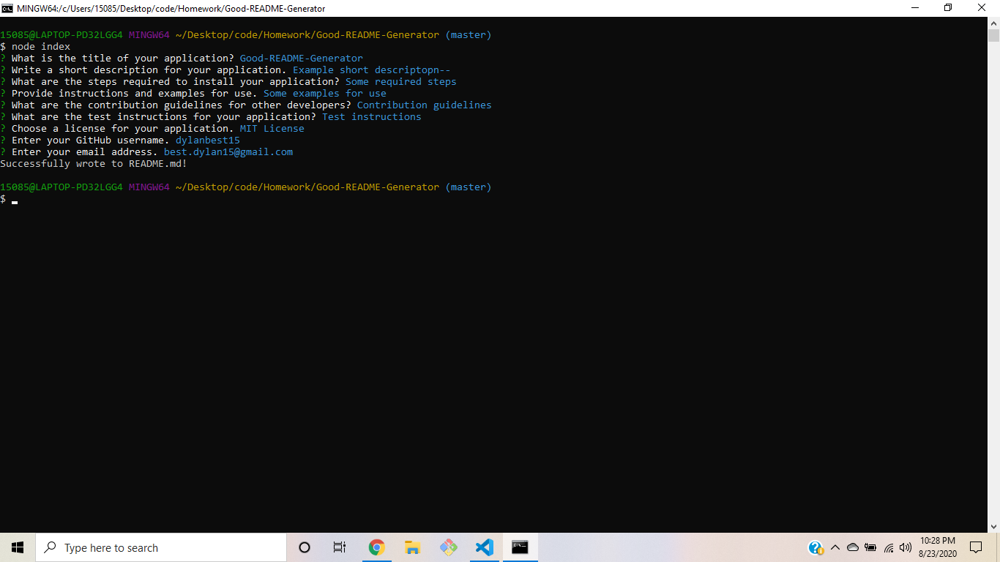
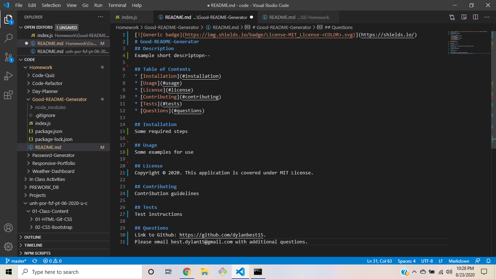

# Good-README-Generator

## Showcase Video
https://drive.google.com/file/d/1cens6B56pkH4YeyZb40wf4jZgW0vfLRE/view

## Screenshots

## Description
This application generatoes a good README file for their own applications and projects. Using Node.js, when the user runs the application they will be prompted with different sections of the README including: description, installation, usage, license, contributing, tests, and questions. It will then generate a README with what the user entered, and also include a table of contents and a badge for the license. This application is useful for anyone who wishes to include a good README file with their applications.

## Table of Contents
* [Installation](#installation)
* [Usage](#usage)
* [License](#license)
* [Contributing](#contributing)
* [Tests](#tests)
* [Questions](#questions)

## Installation
This application requires Inquirer to be installed (npm install Inquirer). See package.json. 

## Usage
To use this application, run the index.js file in Node and follow the prompts. It will generatore a README.md file with the user's answers.

## License
Copyright © 2020. This application is covered under MIT License. 

## Contributing
This application follows standard Contributor Covenant Code of Conduct v2.0 guidelines.

## Tests
There are no tests for this application as of now.
    
## Questions
Link to Github: https://github.com/dylanbest15.
Please email best.dylan15@gmail.com with additional questions.